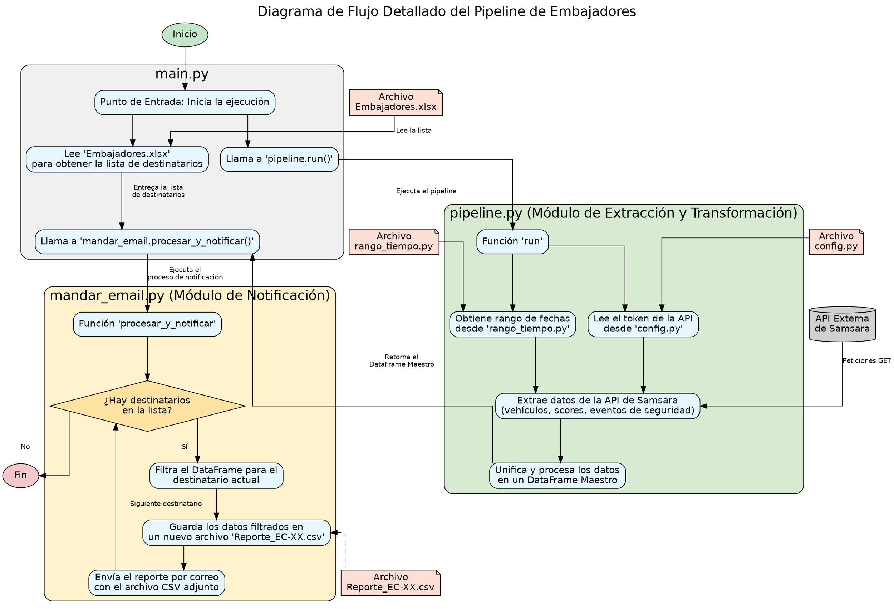

# Código del Diagrama de Flujo Completo (Formato DOT)

Copia y pega el siguiente código en un renderizador de Graphviz (como [Graphviz Online](https://dreampuf.github.io/GraphvizOnline/)) para generar el diagrama de flujo visual.

