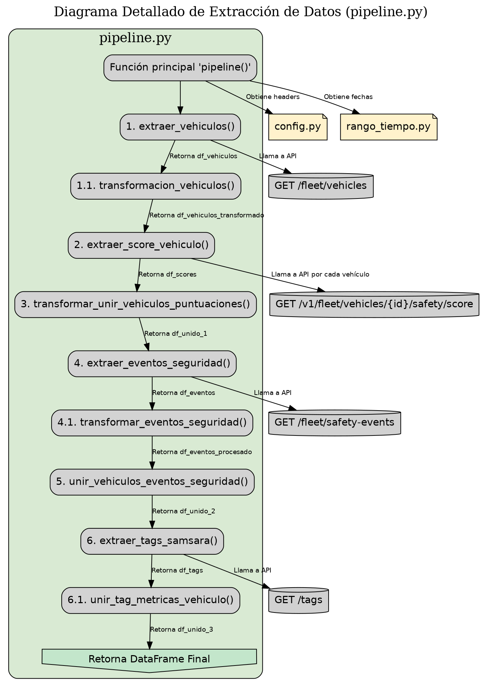

# Diagrama Detallado de Extracción de Datos (Formato DOT)

Este diagrama se enfoca exclusivamente en el funcionamiento interno de `pipeline.py`, detallando las funciones y los endpoints de la API que se utilizan.

