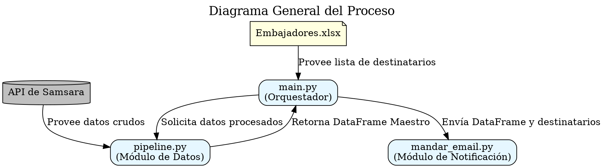

# Diagrama General del Proceso (Formato DOT)

Este diagrama muestra una vista de alto nivel de la interacción entre los diferentes componentes del sistema.

```dot
digraph GeneralFlow {
    rankdir=TB;
    graph [label="Diagrama General del Proceso", labelloc=t, fontsize=18];
    node [shape=box, style="rounded,filled", fillcolor="#E6F7FF"];
    
    // Nodos Principales
    main [label="main.py\n(Orquestador)"];
    pipeline [label="pipeline.py\n(Módulo de Datos)"];
    email [label="mandar_email.py\n(Módulo de Notificación)"];
    
    // Archivos de Datos
    excel_file [label="Embajadores.xlsx", shape=note, style=filled, fillcolor=lightyellow];
    api [label="API de Samsara", shape=cylinder, style=filled, fillcolor=gray];
    
    // Flujo
    main -> pipeline [label="Solicita datos procesados"];
    api -> pipeline [label="Provee datos crudos"];
    
    excel_file -> main [label="Provee lista de destinatarios"];
    
    pipeline -> main [label="Retorna DataFrame Maestro"];
    
    main -> email [label="Envía DataFrame y destinatarios"];
}
```
